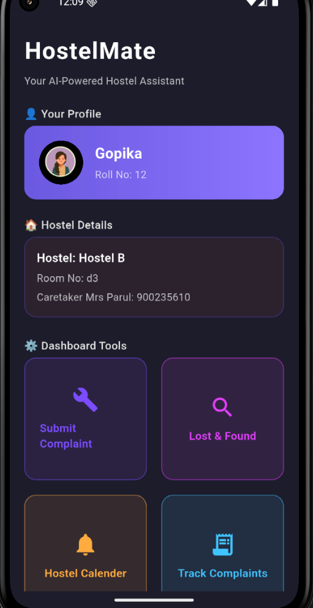
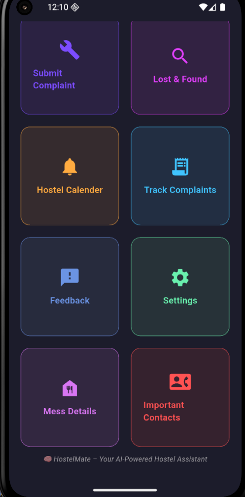

# 🏠 HostelMate

**HostelMate** is a smart mobile app that streamlines hostel complaint handling and lost & found management using **Firebase**, **Flutter**, and **Google AI technologies**. It was created to solve real-world inefficiencies of Hostel Maintenence System.

---

## 🔍 Problem Statement

In most hostels, complaints are handled informally through:

- WhatsApp groups or paper logs  
- No tracking, status, or escalation  
- Lost items are rarely returned due to lack of system

These lead to frustration, delays, and a lack of accountability.

---

## ✅ Our Solution

### 🛠 Maintenance Complaint System
- Submit complaints with category, description, and image
- Track status: **Pending → In Progress → Resolved**
- Admin dashboard for caretakers to update statuses

### 🧳 Lost & Found Portal
- Post lost or found items with photos
- AI-assisted tagging using **Gemini API**
- Smart match suggestions and recent activity

### 🤖 Gemini AI-Powered Hostel Bot
- A futuristic chatbot built using **Google Gemini API**
- Users can ask hostel-related questions like rules, timings, or processes
- UI designed as a **conversation experience**, aligned with HostelMate's dark futuristic theme

---

## 🧰 Tech Stack

| Feature                   | Technology                          |
|---------------------------|--------------------------------------|
| App Platform              | Flutter                              |
| Backend & Database        | Firebase Firestore                   |
| Hosting & Functions       | Firebase Hosting, Cloud Functions    |
| Authentication (Planned) | Firebase Auth                        |
| AI Integration            | Gemini API via Google AI Studio      |
| Emulator & IDE            | VS Code + Android Emulator           |

---

## 👥 Target Users

- **Students**: File complaints, track them, find lost items, get help from the AI bot
- **Caretakers/Wardens**: View, manage, and resolve complaints efficiently

---

## 🎯 Key Features

- 📋 Complaint filing and tracking  
- 🧠 **Hostel AI Bot powered by Gemini**  
- 🧳 Lost & Found submission and viewing  
- 👤 User profile stored locally and in Firestore  
- 🚀 Clean and responsive UI (dark theme, scrollable dashboard, modern cards)

---

## 🚧 Project Status

| Feature                       | Status      |
|------------------------------|-------------|
| Core Dashboard UI            | ✅ Complete |
| Firebase Firestore Integration | ✅ Done    |
| Complaint System             | ✅ Done     |
| Lost & Found Screen          | ✅ Done     |
| Gemini AI Bot                | ✅ Integrated |
| Persistent Login/Profile     | ✅ Done     |
| Admin Panel                  | ⏳ Upcoming |
| Firebase Auth                | ⏳ Upcoming |
| Google Calendar API          | ⏳ Upcoming |
| Cloud-based Mess Info        | ⏳ Upcoming |

---

## 🌱 Future Goals

- 🔐 Full **Login/Signup** with Firebase Auth  
- 📅 **Google Calendar Integration** to show hostel events and holidays  
- 🍽️ Mess schedule & menu updates using **Google Cloud Functions + Firestore**  
- 🎓 Training the **Gemini AI bot** with custom hostel knowledge base  
- 📊 Admin-side analytics and notifications

---

## 💡 Why This Project?

Built by a **former Maintenance Coordinator at IIT Mandi**, HostelMate is inspired by real hostel challenges. It transforms how students and staff handle day-to-day issues with transparency and technology.
Gopika Chauhan

---

## 🧪 Demo Screenshots

  

---

## 👩‍💻 Developer

**Gopika Chauhan**  
📧 gopikachauhan1819@gmail.com  
🔗 [LinkedIn](https://www.linkedin.com/in/gopika-chauhan18/)  
💻 [GitHub](https://github.com/Cephei18)

---
